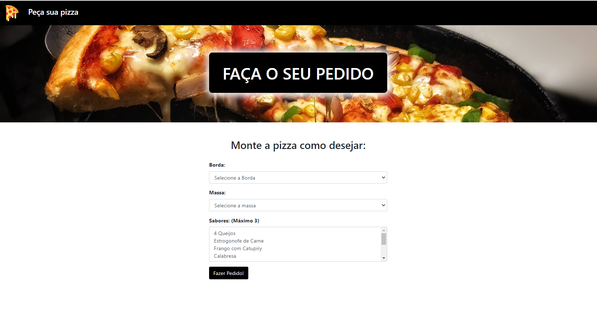

<h1 align="center"> Pizzaria do Jhonny </h1>

Projeto final que fiz nas minhas aulas de Banco de dados.

  <a href="#-tecnologias">Tecnologias</a>&nbsp;&nbsp;&nbsp;|&nbsp;&nbsp;&nbsp;
  <a href="#-projeto">Projeto</a>&nbsp;&nbsp;&nbsp;|&nbsp;&nbsp;&nbsp;
  <a href="#memo-licença">Licença</a>

  

 

  

## 🚀 Tecnologias

Esse projeto foi desenvolvido com as seguintes tecnologias:

- HTML 
- CSS
- PHP
- MySql

## 💻 Projeto

Pizzaria do Jhonny é uma aplicação web onde no index o cliente faz o pedido da pizza e na dashboard o pizzaiolo tem a acesso aos pedidos, podendo atualizar o status e excluir depois de ser efetuada a entrega.

##  Licença

Esse projeto está sob a licença MIT.

---

